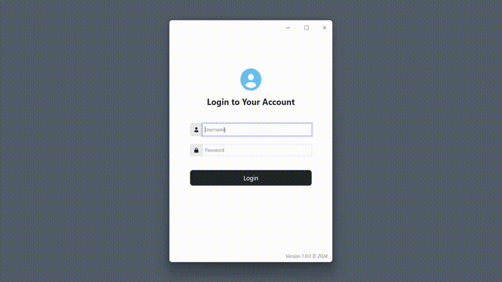

# Electron IPC Example
A simple Electron application demonstrating Inter-Process Communication (IPC) between the main and renderer processes.

  
The example showcases IPC to control window actions such as minimize, maximize, and close.
